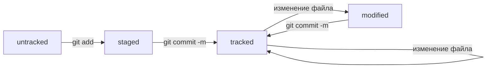

# Большая шпаргалка по git
---
## Иницилизация репозитория
**git init** - инцицилизация репозитория в текущей папке

**git status** - проверка статуса репозитория

**Удаление** репозитория происходит путем удаления каталога .git

---
## Добавление файлов в репозиторий
**git add** - подготовка файла к сохранению

**git add -all** - подготовка к сохранению сразу всех файлов

**git add .** - добавление в репозиторий текущей папки со всеми файлами

---
## Создание ssh ключей и привязка локального репозитория к github.com\
**ssh-keygen -t ed25519 -C "ПОЧТА"** - генерация ssh ключа

Далее необходимо скопировать публичный ключ (ed25519.pub) и привязать его к github.com

**git remote add origin git@github.com:%ИМЯ_АККАУНТА%/%ИМЯ_РЕПОЗИТОРИЯ%.git** - привзяка репозитория

**git remote -v** - просмотр всех привязанных репозиториев

---
## Отправка изменений
**git commit -m "Комментарий"** - commit (применение) изменений

**git push origin master** - загрузка изменений (в данной случае в ветку master)

---
## Файл HEAD
**HEAD** - файл в каталоге с репозиторием, который указывает на последний сделанный коммит

Внутри **HEAD** хранится ссылка на служебный файл, в котором содержиться хэш последнего комиита

---
## Статусы файлов в git
### Untracked
**Untracked** - статус файла, который git видит, но не отслеживает его изменения

### Staged
**Staged** - статус файла, который подготовлен к коммиту с помощью **git add**

Он попадает в так называемую **stagin area**. Ее также называют index или cache

### Tracked
**Tracked** - состояние противоположеное untracked. 

В него попадают файлы, которые были добавлены через git add, а также те, которые уже были добавлены в коммиты.

### Modified

**Modified** - состояние, которое присваивается изменным файлам.

---
## Схема жизненного цикла файла в git

---